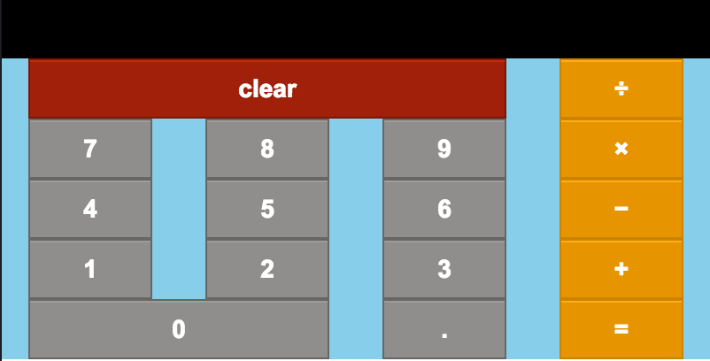
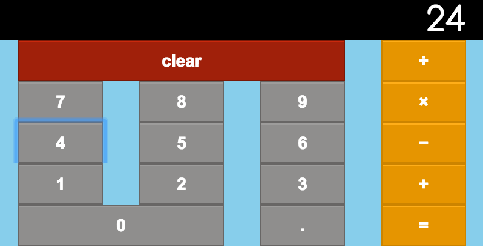

# Calculator
This application was created for an assignment for Prime Digital Academy and uses jQuery, Bootstrap, Node.Js, and Express.

The <b>Calculator</b> functions much like a regular calculator. It takes in 2 values and a type of mathematical operation. The calculator returns the calculated value of the inputs.

## Features
[Clear Button](#clear) | [Interface](#interface)

### <a name="clear">Clear Button</a>###

The clear button restarts the experience.

### <a name="interface">Interface</a>###

The interface functions like an actual calculator so pressing "2" before "4" results in the number "24". Then, a mathematical operator can be inputed at any time, followed by the next numerical value.

## Usage
Need to run `npm install`. Following that run `npm start` and on your browser go to `localhost:3000`.

# Author
- elisa lee
